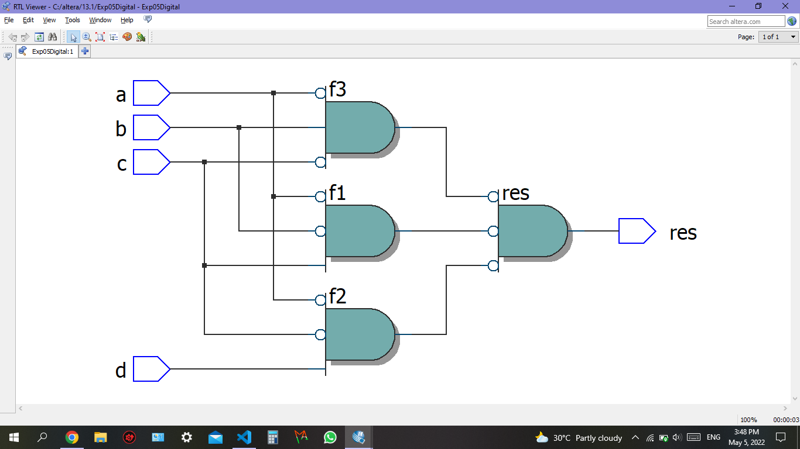

# Experiment--04-Implementation-of-combinational-logic-using-universal-gates-
 ## Implementation-of-Half-subtractor-and-Full-subtractor-circuit
## AIM:
To implement the given logic function using NAND and NOR gates and to verify its operation in Quartus using Verilog programming.
F=((C'.B.A)'(D'.C.A)'(C.B'.A)')' using NAND gate
F=(((C.B'.A)+(D.C'.A)+(C.B'.A))')' using NOR gate


## Equipments Required:
#Hardware – PCs, Cyclone II , USB flasher
## Software 
Quartus prime
## Theory


## Procedure
Step1 : Using the Quartus software we can get the gate diagram and timing diagram.

Step2: After complting the code run it and after clicking netlist viewer click the RTL viewer for gate diagram.

Step3: By clicking the universal option we can get the timing diagram.


## Program:
```
Developed by: J.Archana Priya
RegisterNumber:  212221230007

NAND Gate:

module Exp05Digital(a,b,c,d,res);
input a,b,c,d;
output res;
wire f1,f2,f3;
assign f1= (c & ~b & ~a);
assign f2= (d & ~c & ~a);
assign f3= (~c & b & ~a);
assign res= (~f1 & ~f2 & ~f3);
endmodule


NOR Gate:

module Exp05Digital02 (a,b,c,d,f);
input a,b,c,d;
output f;
wire f1,f2,f3;
assign f1= (c& ~b &a);
assign f2= (d & ~c &a);
assign f3 = (c & ~b &a);
assign f= ((f1|f2|f3)); 
endmodule 

```

## Output:

## Truthtable


##  RTL realization



## Timing diagram 


## Result:
The given logic function using NAND and NOR gates and to verify its operation in Quartus using Verilog programming has been successfully implemented.
 
